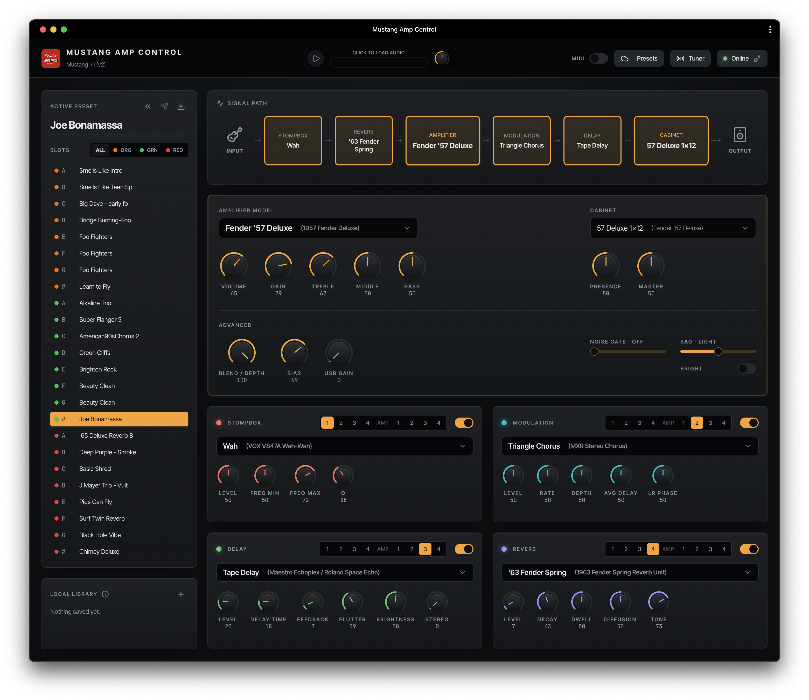
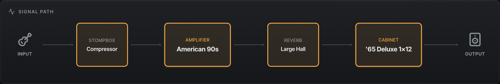
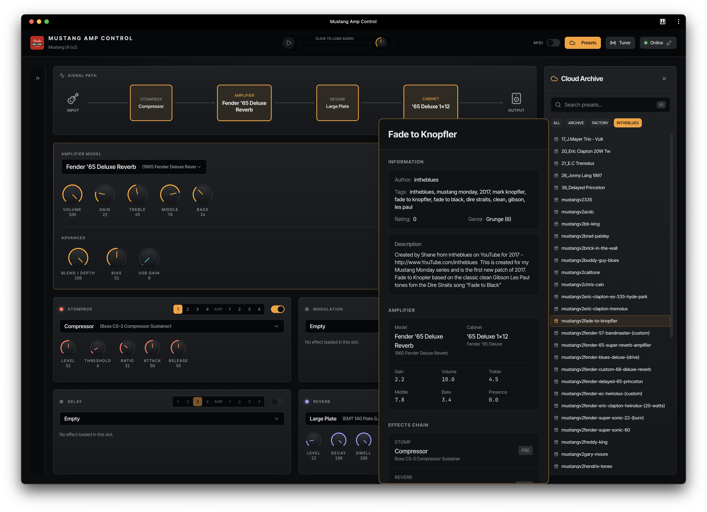
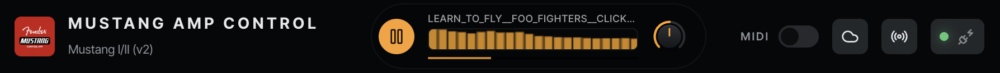
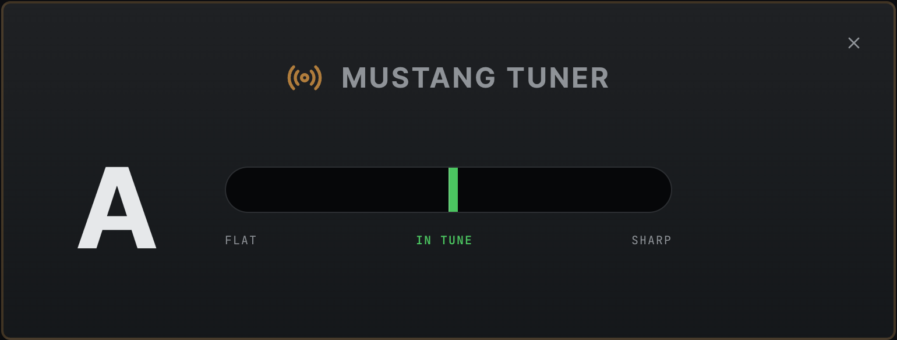

# Fender® Mustang™ Control App 🎸

| | |
|---|---|
|  | **The ultimate modern, cross-platform, and installation-free editor for Fender Mustang™ amplifiers.**<br><br>Say goodbye to outdated software. Control your Fender Mustang I/II/III/IV/V amplifier directly from your web browser or run it as a lightweight native desktop app.<br><br>**[🚀 Try it now: https://mustang.artnettune.com/](https://mustang.artnettune.com/)** |

## 🌟 The Ultimate Fender FUSE™ Replacement

When Fender discontinued **Fender FUSE**, guitarists worldwide lost their primary way to customize and manage their Mustang amplifiers. **Mustang Amp Control** is a community-driven modern revival.

Unlike other tools, this is **not** just a MIDI mapper. It is a fully-featured, high-performance editor that directly implements the native USB HID protocol. It gives you 1:1 control over every knob, amplifier model, effect parameter, and signal chain configuration, all wrapped in a gorgeous, responsive, modern user interface.

## 🚀 Key Features

### 1. Run It Anywhere & Offline (WebHID & PWA!)
* **Zero-Installation Web App:** Got Google Chrome, Edge, or any Chromium-based browser? Connect your Mustang via USB, navigate to the app, and you're ready to rock!
* **Offline PWA (Progressive Web App):** Install the app directly from your browser to your desktop or mobile device with a single click. It caches all files, layout systems, and preset library elements automatically, letting you tweak your amp 100% offline anywhere without needing an internet connection.
* **WebHID Native:** Communicates directly with your hardware safely from the browser, bypassing the need for heavy drivers or midi bridge software.
* **Cross-Platform Desktop Apps:** Need an offline native app? Run the lightweight Electron-powered builds on **Windows, macOS (Intel & Apple Silicon), and Linux** (coming soon).

### 2. Interactive Virtual Control Surface
* **Bidirectional Real-Time Sync:** Control your amp from the app or directly from the physical amplifier—all changes sync instantly in both directions with sub-millisecond latency. Twist a knob on the screen, and the physical amp updates instantly. Adjust the amp's knobs physically, and the app reflects every change in real-time!
* **Exact Amp Profiles:** Accurately replicates physical control parameters (Gain, Volume, Treble, Middle, Bass, Reverb, Presence, Bias, and SAG) depending on your selected amp model.
* **Master USB Gain:** Control hidden hardware-level settings like USB Gain directly from the dashboard.
* **Always in Sync:** The app continuously monitors your amp's state, ensuring the virtual interface always reflects the true current configuration of your hardware.



### 3. Visual Signal Chain Editor
* **Interactive Routing:** Visualize your entire signal path from **Stompbox ➡️ Amp Model ➡️ Modulation ➡️ Delay ➡️ Reverb**.
* **One-Click Bypass:** Toggle individual effects in and out of the signal chain instantly.
* **Deep Parameter Editing:** Click on any effect block to open a specialized panel to tweak everything from delay feedback times to chorus waveforms.
* **Drag & Drop Effects:** Easily reorder effects by dragging them along the signal chain to move between pre and post positions, giving you total control over your signal flow.



### 4. Built-in Preset Library & Archive
* **Hundreds of Classic Presets:** Ships with a pre-loaded archive of hundreds of legendary presets (Fender factory defaults, intheblues libraries, and more than nine thousands of community favourites).
* **FUSE Compatibility:** Fully compatible with standard `.fuse` XML files. Import and export your presets effortlessly.
* **Search & Filter:** Instantly filter through massive preset directories to find the exact tone you're looking for.



### 5. Integrated Backtrack Player
* **Play Along:** Load backing tracks (`.mp3`, `.wav`, etc.) directly inside the editor.
* **Jam-Ready Controls:** Adjust backtrack volume, seek positions, and play along while tweaking your presets in the same window!



### 6. Advanced MIDI Control (MIDX-20 Spec)
* **MIDI Mapping:** Select any connected MIDI device to control your Mustang.
* **Foot Controller Ready:** Built-in support for the standard MIDX-20 specification, allowing you to switch presets, bypass effects, and adjust values with expression pedals or MIDI foot controllers.


### 7. Built-in Amp Tuner Control
* **Enable/Disable Tuner:** Activate or deactivate the Mustang amp's built-in tuner directly from the app.
* **Real-Time Tuning Display:** View your guitar's tuning status in real-time as you pluck each string.
* **Seamless Integration:** Control the amp's tuner without leaving the editor interface—keep tweaking presets while staying in tune.
* **Accurate Feedback:** Leverage the amp's hardware tuner for reliable, consistent tuning information.



### 8. Developer & Hacker Friendly
* **Live USB Traffic Log:** Includes a built-in real-time packet analyzer. See the exact raw hexadecimal reports (`0x1c`, `0xc3`, `0xff`) being exchanged with your amplifier.

## 📋 Compatibility & Browser Requirements

Before plugging in your Fender Mustang, please make sure your setup meets the following browser and device requirements:

### Supported Browsers (Chromium-Based)
To use the browser-based editor, you must use a browser that natively supports **WebHID**:
* **Supported:** Google Chrome, Microsoft Edge, Opera, Vivaldi, Brave (version 89 or later).
* **Not Supported:** Mozilla Firefox and Apple Safari. (These browsers do not implement the necessary WebHID standard required to communicate directly with USB hardware).

### iOS & iPadOS Limitations (iPhone / iPad)
* **iOS is Not Supported:** Web-based editing cannot be performed on iPhones or iPads.
* **Why?** Apple restricts all browsers on iOS/iPadOS to use their own WebKit rendering engine (which lacks WebHID support). Furthermore, iOS does not expose raw USB HID interfaces to web browsers, making physical USB connections technically impossible on Apple mobile platforms.

## 📥 Get Started in Seconds

### Online Web App
1. Turn on your Fender Mustang I/II/III/IV/V amp and connect it to your computer via USB.
2. Open a Chromium browser (Chrome, Edge, Opera, Vivaldi) and navigate to [https://mustang.artnettune.com/](https://mustang.artnettune.com/)
3. Click **Connect**, select your Mustang from the list, and start tweaking!

### Go Offline with PWA (Highly Recommended)
1. In your Chromium browser, click the **Install** icon in the address bar (typically represented by a computer monitor icon with a down arrow, or a "+" symbol).
2. Confirm the installation to save **Mustang Amp Control** directly to your applications or desktop.
3. Launch the app anytime from your computer. It works completely offline, letting you load/save presets and fully control your amp without any internet connection.

## 🐧 First-Class Linux Support

Fender FUSE historically ignored Linux users. Mustang Amp Control treats Linux as a first-class citizen! Simply configure a lightweight `udev` rule to unlock raw HID access for Chromium or the Electron desktop app:

```udev
# /etc/udev/rules.d/50-mustang.rules
SUBSYSTEM=="usb", ATTR{idVendor}=="1ed8", MODE="0666", TAG+="uaccess"
KERNEL=="hidraw*", ATTRS{idVendor}=="1ed8", MODE="0666", TAG+="uaccess"
```

## 🤝 Feedback & Support

Have feedback, want to share presets, or report bugs?
* **Bug Reports & Feedback:** Report bugs or suggest new features easily.
* **Get in Touch:** Reach out to share preset libraries or general suggestions to improve the controller experience.

---

*Fender Mustang, Fender FUSE, and the associated product names are trademarks of Fender Musical Instruments Corporation. This project is a community-built editor and is not affiliated with or endorsed by Fender.*
